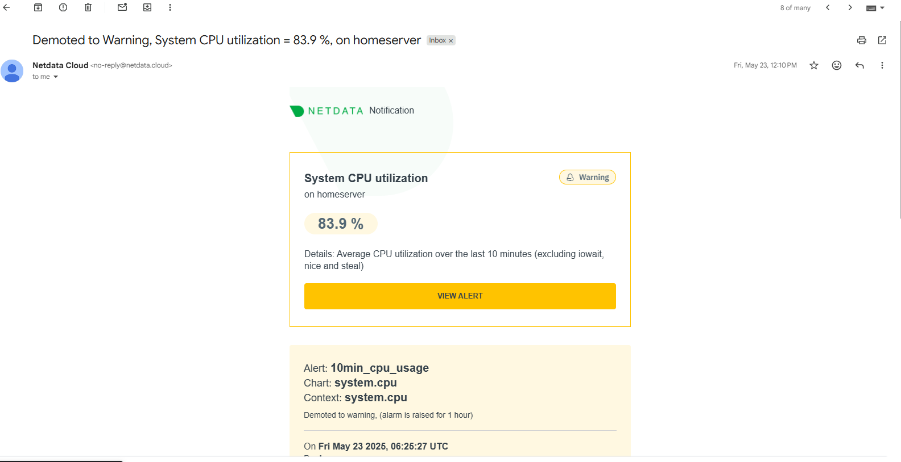
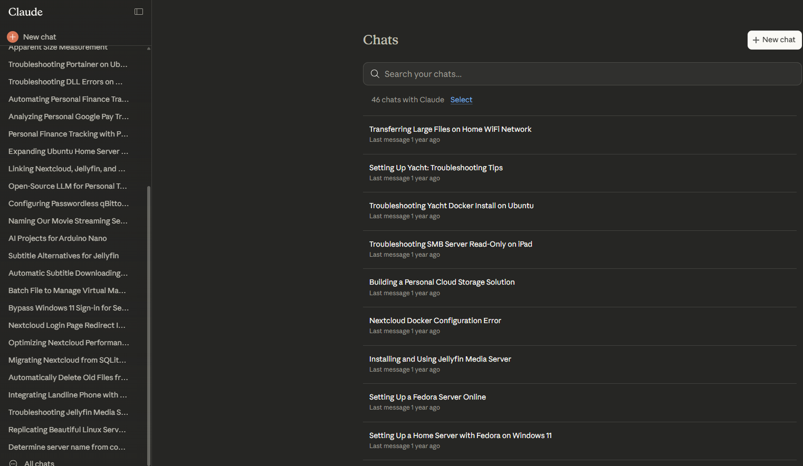
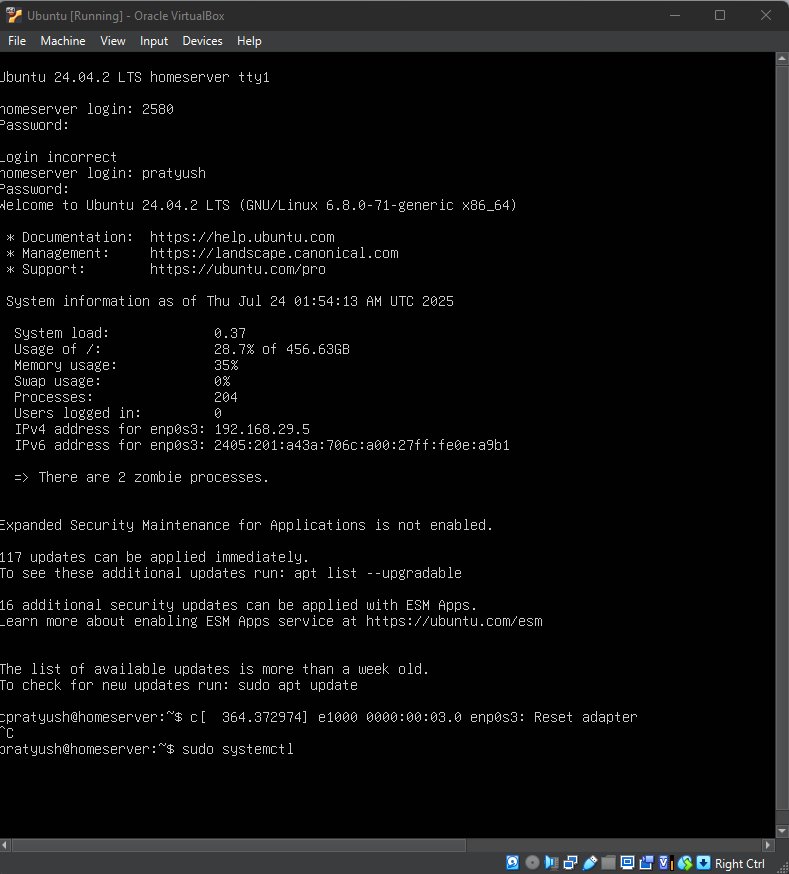
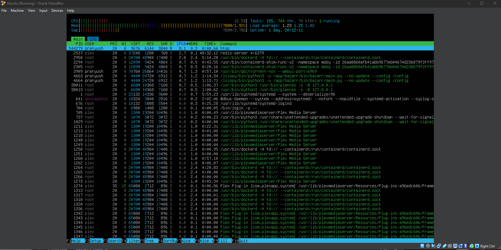
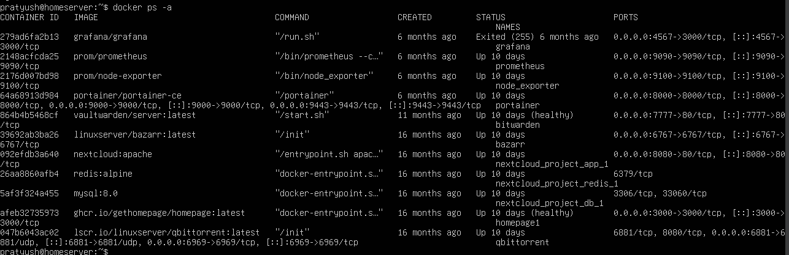

# 🏠 Ghar Labs v1: The "Genesis" Server (Legacy Archive)


> **⚠️ ARCHIVE NOTICE:** This project is no longer active. It represents the "Proof of Concept" state of my homelab infrastructure from **July 2024 to July 2025**. All services and data have been migrated to a dedicated **TrueNAS Scale** machine (Ghar Labs v2) for enterprise-grade redundancy.

---

<div align="center">
  <h2>🗺️ Project Architecture & Evolution Mind Map</h2>
  
  <br>
  *(Fig 1: A high-level visualization of the research pathways, technology stack choices, and final architecture of the v1 prototype)*
</div>

---

## 📖 The Origin Story

In **July 2024**, I had a spare **500GB hard drive**, a virtualization host, and a goal to centralize my fragmented digital life.

The project began as a basic NAS but "scope creep" turned it into a monolithic microservices host running:
1.  **Media Automation:** Jellyfin + *Arr stack.
2.  **Sovereign Cloud:** Nextcloud for file sync.
3.  **Observability:** A mix of Prometheus, Grafana, and **Netdata** for real-time monitoring.

---

## 🏗️ Technical Architecture

This system ran as a single **Ubuntu Server 24.04 LTS** virtual machine, orchestrating 10+ containers via Docker Compose.

* **Hypervisor:** Oracle VirtualBox (Windows Host).
* **Resources:** 4 vCPUs, 4GB RAM allocated.
* **Networking:** Bridged Adapter + Cloudflare Tunnels (for public HTTP) + Tailscale (for private SMB/SSH).

---
<hr> 

## 🗳️ The "Unified Storage" Pattern

We avoided duplicate files by pointing the downloader and media player to the same physical directory, using strict PUID/PGID (User 1000) permissions to prevent access errors.

**Directory Structure:**
```bash
/mnt/data/media/
├── movies/         # qBittorrent downloads directly here
└── shows/          # Jellyfin reads directly from here
```

📊 Monitoring & Observability (Netdata)
To keep track of system health on constrained resources, I utilized Netdata for real-time, high-resolution monitoring and alerting.

<div align="center"> 


(Fig 2: The Netdata dashboard revealing CPU context switch spikes during heavy I/O operations)





(Fig 3: Automated email alerts configured for sustained high CPU usage) </div>

🧠 Research & Engineering Logs
This infrastructure is the result of 46+ documented research sessions.

📂 Click Here to Read the Detailed Debugging Logs
Access the full setup-journey.md to see how we bypassed CGNAT, fixed broken installations, and engineered custom Cloudflare error pages.

<div align="left"> 


(Fig 4: The knowledge base built during development) </div>

<hr> 

🛡️ Resilience & Challenges (Post-Mortem Audit)
Before decommissioning the VM in July 2025, I performed a final audit. The system was functional but brittle.

🛑 Challenge 1: The "Zombie" Process Leak
Over weeks of uptime, RAM usage would creep up despite low CPU load. The terminal login screen gave the first clue, and a subsequent htop audit revealed the root cause: Docker containers were not reaping child processes correctly, leading to a growing list of "zombies."

<div align="center"> 


(Fig 5: The login message explicitly warning about "2 zombie processes")





(Fig 6: The final htop audit showing moderate load but increasing memory pressure) </div>

🛑 Challenge 2: Service Fragility (Grafana Crash)
While core services (Jellyfin, Nextcloud) remained stable, heavier JVM/Go-based tools struggled on the 4GB RAM allocation. The final docker audit confirmed that our primary visualization tool, Grafana, had silently crashed.

<div align="center"> 


(Fig 7: docker ps -a output confirming Grafana exited with code 255 six months ago) </div>

🛑 Final Verdict: The Single Point of Failure
The most critical flaw was architectural. The entire lab lived on one virtual disk (.vdi). There was no ZFS bit-rot protection and no RAID. A single host crash could corrupt 1TB of data.

📉 Conclusion: The Move to TrueNAS
Ghar Labs v1 was a successful Proof of Concept that taught me Docker networking and Linux administration. However, the evidence above—zombie processes, silent service crashes, and lack of redundancy—made it clear it was not production-ready.

All services have been migrated to Ghar Labs v2 (TrueNAS Scale).

Maintained by Pratyush | 2024-2025
